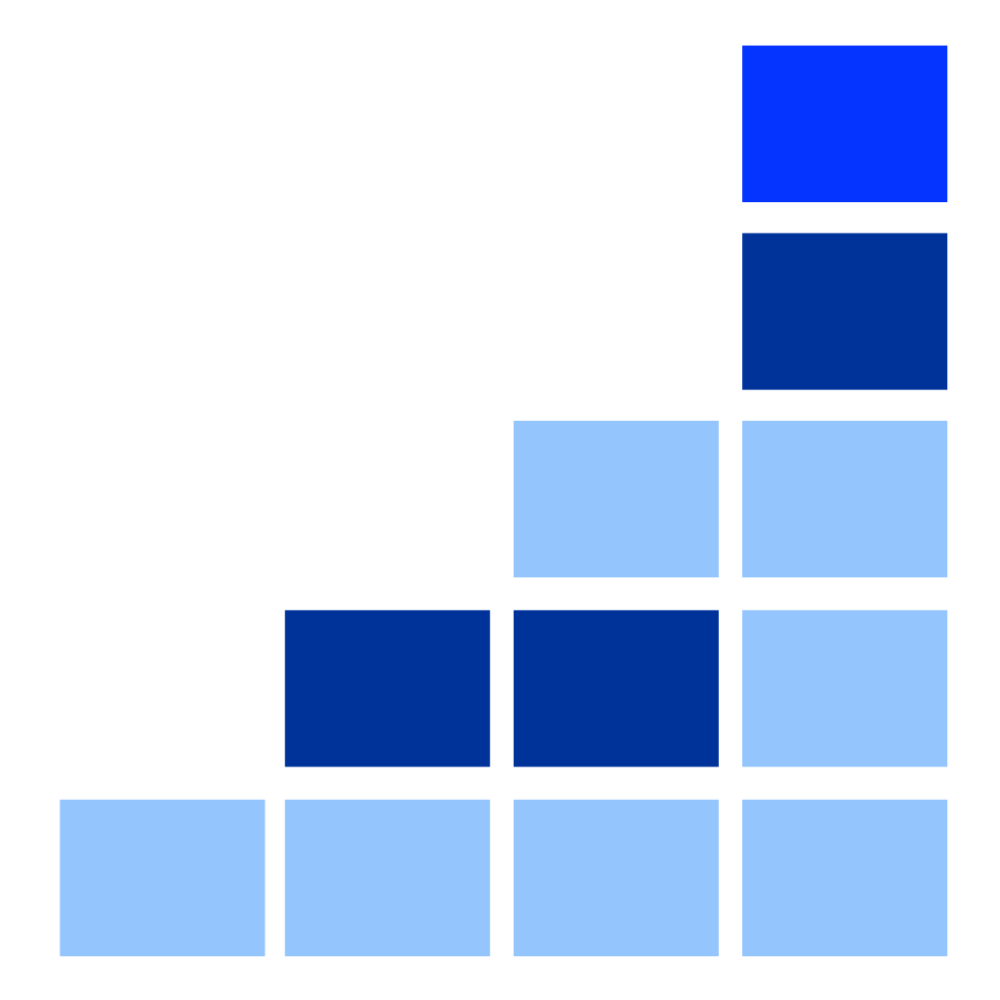
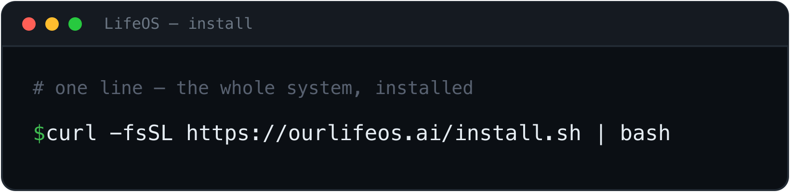

<div align="center">

<picture>
  <source media="(prefers-color-scheme: dark)" srcset="./images/lifeos-logo.png">
  <source media="(prefers-color-scheme: light)" srcset="./images/lifeos-logo.png">
  
</picture>

<br/>
<br/>

# LifeOS

**The Life Operating System**

[](https://github.com/danielmiessler/LifeOS)

<br/>

<!-- Social Proof -->


<!-- Project Health -->


<!-- Content -->
[](#-installation)
[](Releases/v6.0.0/)
[](Releases/v6.0.0/README.md)
[](LifeOS/install/LifeOS/PULSE/)
[](https://github.com/danielmiessler/LifeOS/graphs/contributors)

<!-- Tech Stack -->
[](https://claude.ai)
[](https://www.typescriptlang.org/)
[](https://bun.sh)
[](https://danielmiessler.com/upgrade)

<br/>

**Overview:** [What LifeOS Is](#what-lifeos-is) · [Principles](#principles) · [Features](#features)

**Get Started:** [Installation](#-installation) · [Releases](Releases/) · [Packs](Packs/)

**Resources:** [FAQ](#-faq) · [Roadmap](#-roadmap) · [Community](#-community) · [Contributing](#-contributing)

<br/>

[](https://youtu.be/Le0DLrn7ta0)

**[Watch the full walkthrough](https://youtu.be/Le0DLrn7ta0)** | **[Read: The Real Internet of Things](https://danielmiessler.com/blog/the-real-internet-of-things)**

---

</div>

> [!IMPORTANT]
> **LifeOS 6.0.0 — one skill, one install.** This is the first release under the LifeOS name (the project was called PAI, Personal AI Infrastructure). The whole system now ships as a single self-contained skill. One command lays down everything: the system prompt and operating rules, **Algorithm v6.23.0** (Current State → Ideal State, seven phases), the **ISA** primitive, 49 skills, the hook system, **Pulse** (the Life Dashboard at `localhost:31337`), the statusline, and the memory + USER scaffolds.
>
> **[v6.0.0 release notes →](Releases/v6.0.0/README.md)** | **[All releases →](Releases/)**
>
> **One-line install:** `curl -fsSL https://ourlifeos.ai/install.sh | bash`
>
> New name, same system. If you ran PAI, this is the next version of it — everything you had is still here, with a cleaner way to install it.

<div align="center">

# AI should magnify everyone—not just the top 1%.

</div>

## What LifeOS Is

LifeOS is a Life Operating System. It captures who you are, what you care about, and where you're trying to go — and then helps you get there using AI that knows you. Three layers stack on top of each other:

- **LifeOS** — the OS itself. Skills, memory, the Algorithm, your Telos, your identity files.
- **Pulse** — the Life Dashboard at `localhost:31337`. Where you actually see your state, goals, and work.
- **The DA** — your Digital Assistant. The voice and personality you talk to.

It's designed for individuals first, but the same architecture works for teams, companies, or any entity that wants to articulate what it's trying to be and move toward it.

---

## Principles

### Humans first, tech second

LifeOS puts the human at the center, not the tooling. The tech exists to improve people's lives, not the other way around. Every design decision starts from one question: what does this do for the person running it?

### A Life OS, not an agent harness

LifeOS captures what you care about — goals, work, relationships, health, finances — and helps you pursue your ideal state across all of it. It writes code and runs agents and does the things people associate with AI tooling, but those are capabilities in service of the larger goal. The point is your life, not the tools.

### Ideal State drives everything

The biggest unsolved problem with AI is that nobody can define what "good" or "done" actually means for a given task. LifeOS is built around the concept of Ideal State — specifically the transition from your current state to your ideal state — and it's woven through every layer.

The primary expression is the **ISA** (Ideal State Artifact). An ISA is similar to a software PRD: it captures what done looks like so you can build toward it. The difference is that an ISA is general — it works for any creative task, from design to art to philosophy to engineering to strategy. The system decomposes the ideal state into discrete **ISCs** (Ideal State Criteria), which populate the document and double as verification items. That's how LifeOS hill-climbs toward ideal state on any kind of work.

### A single Digital Assistant will be everyone's interface to AI

I wrote about this in 2016 in [The Real Internet of Things](https://danielmiessler.com/blog/the-real-internet-of-things), and I'm more convinced now than I was then. The trajectory is clear: chatbots → agents → assistants. We're all building the same thing, and the endpoint is one DA per person.

TRIOT had four core ideas that LifeOS is built on:

- **Digital Assistants** — one DA per person, your primary interface to all AI
- **Everything gets an API** — every product, service, person, and place becomes addressable
- **Your DA dynamically creates your interfaces** — no more apps and dashboards; the DA assembles whatever you need in the moment
- **You define your ideal state, AI helps you get there** — the whole system points at your Telos

This is what LifeOS is reaching for.

---

## Features

### Text over opaque storage

Heavy bias toward plain text and Markdown. LifeOS avoids SQLite, Postgres, and other opaque stores wherever possible. Everything should be transparent and parsable — by you, by your DA, by `rg`, by anything else. If you can't read it with `cat`, we don't want it.

### Context scaffolding > model

The mistake most people make with AI is failing to feed it the big picture. LifeOS is fundamentally a system for handing the smartest models the right context — about you, about what you're trying to accomplish, about the tools they have — so they can actually help you reach your ideal state. The model matters less than what surrounds it.

### Bitter-pilled engineering

The flip side of context scaffolding: as models get stronger, they need fewer instructions on how to do the work. We constantly audit LifeOS to remove overly prescriptive direction in places where the model can do better with just the right context and tools. The system gets smaller as the models get bigger.

### Filesystem as context, no RAG

LifeOS has avoided RAG since June 2025. Rich text with cross-references, plus fast search like ripgrep, gives us everything people normally want from RAG — without the embedding complexity, the retrieval flakiness, or the loss of fidelity. Your filesystem is the index.

### Memory that compounds

A text-based memory system that captures what you've done, what you've learned, and what's worth keeping — and feeds it back as input to future work. Three tiers (WORK, KNOWLEDGE, LEARNING) plus a typed graph across people, companies, ideas, and research.

### Self-improvement loop

LifeOS captures signals about what went well and what didn't — explicit ratings, sentiment, verification outcomes, satisfaction — and uses them to improve itself. The system that runs the work is also the system that gets better at running it.

### The Algorithm

A custom algorithm that drives the current → ideal state transition through a seven-phase loop modeled on the scientific method, using Deutsch's framing of hard-to-vary explanations as the standard for "good." It's the gravitational center of LifeOS — every non-trivial task runs through it.

### Skills as deterministic units

A skill system biased toward deterministic code execution. The hierarchy is: code → CLI to run the code → workflows that prompt the CLI → a SKILL.md that routes between workflows. The skill is the container; SKILL.md is the front door; the actual work is real code wherever possible. Prompts wrap code; code doesn't wrap prompts.

### Thinking skills

A meaningful library of custom thinking skills — first principles, council debates, red team, root cause, systems thinking, iterative depth, aperture oscillation, and more — that the Algorithm pulls from to raise the quality of decisions across the system.

---

## Core Components

What actually makes LifeOS work, in two tiers. The **unique features** are the parts you won't find anywhere else. The **supporting components** are the subsystems underneath them.

### The unique features

- **Current State → Ideal State** — the whole idea. Name where you are, name where you want to be, then close the gap with steps you can check. Everything else serves this move.
- **The Algorithm** — the centerpiece. A seven-phase engine (Observe → Think → Plan → Build → Execute → Verify → Learn) that turns a vague ask into a testable spec and climbs toward it, scaling its own effort to the work.
- **The Skill System** — a growing library of self-activating, composable units of expertise. Deterministic code wrapped in a natural-language trigger, so the right capability fires the moment you describe the task.
- **The Hook System** — deterministic lifecycle interception. Guardrails that are code, not good intentions: they fire at fixed points and enforce the rules a model can't be trusted to remember.
- **The Router System** — every prompt gets classified and routed to the right effort and the right model. Quick asks stay cheap and fast; hard problems get the full engine.
- **Pulse** — the Life Dashboard. The live surface where you watch the whole system run.
- **Custom Spinner Verbs** — your own animated working-verb and rotating tips in the statusline. A small, personal touch most tools never bother with.
- **Custom Tooltips** — the dashboard explains itself on hover, so the surface teaches you instead of sending you to a manual.

### The supporting components

- **Memory** — text-based memory that compounds across sessions (WORK, KNOWLEDGE, LEARNING) plus a typed graph.
- **Agents** — parallel delegation to specialized researchers, builders, and adversarial reviewers.
- **Voice** — spoken notifications in a voice you choose, so you stay in flow.
- **Learning** — every run reflects on itself and feeds what it learned back into the next one.
- **Security** — deterministic gates that keep private data private and block anything unsafe before it runs.

Full docs for every component: **[docs.ourlifeos.ai](https://docs.ourlifeos.ai)**

---

## 🚀 Installation

> [!CAUTION]
> **Project in Active Development** — LifeOS is evolving rapidly. Expect breaking changes, restructuring, and frequent updates.

### Use your AI to install and run LifeOS

We very much believe in AI-based installation and modification of LifeOS. Once you have a working install, point your AI at the system itself — upgrade versions, add skills, modify hooks, change settings, repair anything that breaks. The most important thing your AI can do for you up front is bring all of your existing custom context — notes, project state, preferences, identity, history — into your `USER/` directory so LifeOS knows who you are from day one. Tell your DA: *"Help me migrate my context into LifeOS."* The system was designed to be operated by AI; lean on it.

### One-line install (recommended)

<div align="center">

<a href="https://ourlifeos.ai"></a>

</div>

```bash
curl -fsSL https://ourlifeos.ai/install.sh | bash
```

That's it. LifeOS ships as a single self-contained skill. The installer verifies Bun and Claude Code, deploys the whole system, sets up your DA identity and voice, registers Pulse, and runs the setup interview. An existing `~/.claude/` is backed up before anything is overwritten.

> [!TIP]
> **LifeOS is AI-native — it installs *into* your AI coding harness.** Run the one-liner in your terminal, or just paste it to your AI (Claude Code) and say *"install this."* It pulls the LifeOS skill from GitHub, drops it into your harness, then hands off to **`/lifeos-setup`** — a setup *conversation* with your AI that captures your goals (TELOS) and wires everything with your permission. No forms, no config files to hand-edit. The whole point: your AI installs and configures LifeOS for you.

**Prefer to inspect first?** [Read the script](https://ourlifeos.ai/install.sh) before piping it.

### Manual install (clone + run)

```bash
git clone https://github.com/danielmiessler/LifeOS.git
cd LifeOS/LifeOS/install
bash install.sh
```

Everything the system needs lives inside the `LifeOS/` skill: the orchestrator (SKILL.md + Workflows + Tools) and the whole-system payload under `LifeOS/install/`.

### After install

```bash
open http://localhost:31337    # the Life Dashboard
```

Then run `/interview` in Claude Code. Your DA will guide you through:

1. **Phase 1 — TELOS:** Mission, Goals, Beliefs, Wisdom, Challenges, Books, Mental models, Narratives
2. **Phase 2 — IDEAL_STATE:** What does success look like for you?
3. **Phase 3 — Preferences:** Tools, conventions, working style
4. **Phase 4 — Identity:** Final DA personality tuning

This is the most important step. **Without TELOS, your DA has nothing to optimize against.**

### Upgrading from PAI (v5.x and earlier)

> [!IMPORTANT]
> LifeOS 6.0.0 is the same system under a new name, with a new skill-based install. Your USER content carries forward.

Quick path:

```bash
# 1. Back up your existing installation
cp -R ~/.claude ~/.claude.backup-$(date +%Y%m%d)

# 2. Install LifeOS 6.0.0 (one-liner above)
curl -fsSL https://ourlifeos.ai/install.sh | bash

# 3. Open the Life Dashboard and run the interview
open http://localhost:31337
```

If you had personal content in an older version (notes, project state, custom rules), tell your DA: *"Help me migrate my old content into the LifeOS USER structure."* The **Migrate** skill intakes from `.md`/`.markdown`/`.txt`, Obsidian, Notion, Apple Notes — classifies each chunk against the LifeOS taxonomy (TELOS, KNOWLEDGE, PROJECTS, FEED, etc.) and commits with provenance.

**Post-upgrade checklist:**
- [ ] Pulse is alive: `curl -s http://localhost:31337/api/pulse/health | jq`
- [ ] Voice announces: `curl -s -X POST http://localhost:31337/notify -H "Content-Type: application/json" -d '{"message": "Hello from your DA"}'`
- [ ] Dashboard renders: `open http://localhost:31337`
- [ ] DA identity populated in `USER/DIGITAL_ASSISTANT/DA_IDENTITY.md`
- [ ] TELOS captured under `USER/TELOS/`

---

## 📦 Packs

Packs are standalone, AI-installable capabilities you can add to any AI coding harness without installing the full system. Each pack is a self-contained prompt your DA can read and execute — point it at the pack directory and say "install this," and it handles the rest.

**[Browse all packs →](Packs/)**

---

## ❓ FAQ

### How is LifeOS different from just using Claude Code?

LifeOS is built natively on Claude Code and designed to stay that way. We chose Claude Code because its hook system, context management, and agentic architecture are the best foundation available for personal AI infrastructure.

LifeOS isn't a replacement for Claude Code — it's the layer on top that makes Claude Code *yours*:

- **Persistent memory** — Your DA remembers past sessions, decisions, and learnings
- **Custom skills** — Specialized capabilities for the things you do most
- **Your context** — Goals, contacts, preferences—all available without re-explaining
- **Intelligent routing** — Say "research this" and the right workflow triggers automatically
- **Self-improvement** — The system modifies itself based on what it learns

Think of it this way: Claude Code is the engine. LifeOS is everything else that makes it *your* car.

### What's the difference between LifeOS and Claude Code's built-in features?

Claude Code provides powerful primitives — hooks, slash commands, MCP servers, context files. These are individual building blocks.

LifeOS is the complete system built on those primitives. It connects everything together: your goals inform your skills, your skills generate memory, your memory improves future responses. LifeOS turns Claude Code's building blocks into a coherent personal AI platform.

### Is LifeOS only for Claude Code?

LifeOS is Claude Code native. We believe Claude Code's hook system, context management, and agentic capabilities make it the best platform for personal AI infrastructure, and LifeOS is designed to take full advantage of those features.

That said, LifeOS's concepts (skills, memory, algorithms) are universal, and the code is TypeScript and Bash — so community members are welcome to adapt it for other platforms.

### How is this different from fabric?

[Fabric](https://github.com/danielmiessler/fabric) is a collection of AI prompts (patterns) for specific tasks. It's focused on *what to ask AI*.

LifeOS is infrastructure for *how your DA operates*—memory, skills, routing, context, self-improvement. They're complementary. Many LifeOS users integrate Fabric patterns into their skills.

### What if I break something?

Recovery is straightforward:

- **Back up first** — Before any upgrade: `cp -r ~/.claude ~/.claude-backup-$(date +%Y%m%d)`
- **USER/ is safe** — Your customizations in `USER/` are never touched by the installer or upgrades
- **Settings merge, not overwrite** — The installer only updates identity and version fields; your hooks, statusline, and custom config are preserved
- **Git-backed** — Version control everything, roll back when needed
- **History is preserved** — Your DA's memory survives mistakes
- **DA can fix it** — Your DA helped build it, it can help repair it
- **Re-install** — Run the installer again; it detects existing installations and merges intelligently

---

## 🎯 Roadmap

| Feature | Description |
|---------|-------------|
| **Local Model Support** | Run LifeOS with local models (Ollama, llama.cpp) for privacy and cost control |
| **Granular Model Routing** | Route different tasks to different models based on complexity |
| **Remote Access** | Access your LifeOS from anywhere—mobile, web, other devices |
| **Outbound Phone Calling** | Voice capabilities for outbound calls |
| **External Notifications** | Robust notification system for Email, Discord, Telegram, Slack |

---

## 🌐 Community

**GitHub Discussions:** [Join the conversation](https://github.com/danielmiessler/LifeOS/discussions)

**Community Discord:** LifeOS is discussed in the [community Discord](https://danielmiessler.com/upgrade) along with other AI projects

**Twitter/X:** [@danielmiessler](https://twitter.com/danielmiessler)

**Blog:** [danielmiessler.com](https://danielmiessler.com)

### Star History

<a href="https://star-history.com/#danielmiessler/LifeOS&Date">
 <picture>
   <source media="(prefers-color-scheme: dark)" srcset="https://api.star-history.com/svg?repos=danielmiessler/LifeOS&type=Date&theme=dark" />
   <source media="(prefers-color-scheme: light)" srcset="https://api.star-history.com/svg?repos=danielmiessler/LifeOS&type=Date" />
   
 </picture>
</a>

---

## 🤝 Contributing

We welcome contributions! See our [GitHub Issues](https://github.com/danielmiessler/LifeOS/issues) for open tasks.

1. **Fork the repository**
2. **Make your changes** — Bug fixes, new skills, documentation improvements
3. **Test thoroughly** — Install in a fresh system to verify
4. **Submit a PR** with examples and testing evidence

---

## 📜 License

MIT License - see [LICENSE](LICENSE) for details.

---

## 🙏 Credits

**Anthropic and the Claude Code team** — First and foremost. You are moving AI further and faster than anyone right now. Claude Code is the foundation that makes all of this possible.

**[IndyDevDan](https://www.youtube.com/@indydevdan)** — For great videos on meta-prompting and custom agents that have inspired parts of LifeOS.

### Contributors

**[fayerman-source](https://github.com/fayerman-source)** — Google Cloud TTS provider integration and Linux audio support for the voice system.

**Matt Espinoza** — Extensive testing, ideas, and feedback, plus roadmap contributions.

---

## 💜 Support This Project

<div align="center">

<a href="https://github.com/sponsors/danielmiessler"></a>

**LifeOS is free and open-source forever. If you find it valuable, you can [sponsor the project](https://github.com/sponsors/danielmiessler).**

</div>

---

## 📚 Related Reading

- [The Real Internet of Things](https://danielmiessler.com/blog/the-real-internet-of-things) — The vision behind LifeOS
- [AI's Predictable Path: 7 Components](https://danielmiessler.com/blog/ai-predictable-path-7-components-2024) — Visual walkthrough of where AI is heading
- [Building a Personal AI Infrastructure](https://danielmiessler.com/blog/personal-ai-infrastructure) — Full walkthrough with examples

---

<details>
<summary><strong>📜 Update History</strong></summary>

<br/>

**v6.0.0 (2026-07-02) — One Skill, One Install**
- **Skill-based distribution** — the whole system now ships as a single self-contained skill (`LifeOS/`): the orchestrator (SKILL.md + Workflows + Tools) plus a complete install payload (system prompt, Algorithm, 49 skills, hooks, agents, Pulse, statusline, USER + MEMORY scaffolds). One directory, one install.
- **First release under the LifeOS name** — the project was PAI (Personal AI Infrastructure); this is the same system, renamed.
- **One-line install** — `curl -fsSL https://ourlifeos.ai/install.sh | bash` lays down the entire system.
- **Full Pulse on first boot** — the installer stands up the Life Dashboard and menu-bar app, ships generic TELOS templates so the dashboard renders on a fresh install, and runs the setup interview to seed it.
- **Algorithm v6.23.0** — Current State → Ideal State across seven phases, classifier-driven mode + tier, cross-vendor verification at E4/E5.
- **Clean by construction** — nothing personal ships; the USER tree is a blank template you populate. Release gates + a cross-vendor audit run before every publish.
- [Full release notes](Releases/v6.0.0/README.md)

**v5.0.0 (2026-04-30) — Life Operating System**
- **Pulse** — unified daemon (port 31337): voice, hooks, observability, cron, Life Dashboard, wiki API, optional Telegram/iMessage bridges. Replaces every previous loose service.
- **The DA** — Digital Assistant identity layer. PRINCIPAL_IDENTITY + DA_IDENTITY pair, loaded at session start. `/interview` walks you through naming your DA, picking a voice, capturing TELOS.
- **Algorithm v6.3.0** — seven-phase loop (OBSERVE → THINK → PLAN → BUILD → EXECUTE → VERIFY → LEARN). Classifier picks MINIMAL/NATIVE/ALGORITHM and tier (E1–E5) per prompt. Verification doctrine (live-probe, advisor calls, cross-vendor audit at E4/E5).
- **The ISA** — Ideal State Artifact primitive. One document, twelve sections, five identities. Owned by the **ISA skill**.
- **Containment + release tooling** — privacy is structural. Security gates run on every public release; two-stage release (stage → publish) never auto-chains.
- **Memory v7.6** — structured by purpose: WORK, KNOWLEDGE (typed graph), LEARNING, RELATIONSHIP, OBSERVABILITY, STATE.
- [Full release notes + migration guide](Releases/v5.0.0/README.md)

**v4.0.3 (2026-03-01) — Community PR Patch**
- JSON array parsing fix in Inference.ts, 29 dead references removed, portability fixes, user context migration
- [Release Notes](Releases/v4.0.3/README.md)

**v4.0.0 (2026-02-27) — Lean and Mean**
- 38 flat skill directories → 12 hierarchical categories, dead systems removed, CLAUDE.md template system, comprehensive security sanitization
- [Release Notes](Releases/v4.0.0/README.md)

**v3.0.0 (2026-02-15) — The Algorithm Matures**
- Algorithm v1.4.0, persistent PRDs and parallel loop execution, full installer with GUI wizard, agent teams/swarm, voice personality system
- [Release Notes](Releases/v3.0/README.md)

**v2.4.0 (2026-01-23) — The Algorithm**
- Universal problem-solving system with ISC tracking, Euphoric Surprise as the outcome metric
- [Release Notes](Releases/v2.4/README.md)

**v2.0.0 (2025-12-28) — v2 Launch**
- Modular architecture with independent skills, Claude Code native design

</details>

---

<div align="center">

**Built with ❤️ by [Daniel Miessler](https://danielmiessler.com) and the LifeOS community**

*Augment yourself.*

</div>
